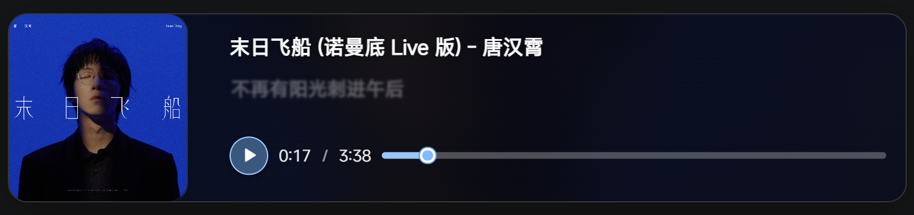

# Blog

A CMS integrated static blog template built with Astro framework and based on [Upstream](https://github.com/Spr-Aachen/Twilight)

[**🖥️ Live Demo**](https://www.etalib.space)
[**📝 Documentation**](https://docs.twilight.spr-aachen.com/en)

## ✨ Features

Based on upstream, I have added some modifications and new features:

### 1. **Music card**
which features **Gaussian blur**, **color picking**, **lyric scrolling vivid animation**, **song covers**, **customizable playback bars**. See the specific effects on [demo](https://www.etalib.space/about/)



2. Remove translation and theme

3. Change `Friend` to `Link`

## 💻 Configuration

1. **Clone the repository:**
   ```bash
   git clone
   cd Blog
   ```

2. **Install dependencies:**
   ```bash
   # Install pnpm if not already installed
   npm install -g pnpm
   pnpm install
   ```

3. **Configure your blog:**
   - [Customize blog settings](https://docs.twilight.spr-aachen.com/en/config/core) inside `twilight.config.yaml`
   - [Support CMS functionality](https://docs.twilight.spr-aachen.com/en/config/cms) inside `.env`
   - [Support Umami analytics](https://docs.twilight.spr-aachen.com/en/config/analytics) inside `.env`
   - [Manage site content](https://docs.twilight.spr-aachen.com/en/config/content) inside `src/content`

4. **Start the development server:**
   ```bash
   pnpm dev
   ```


## ⚡ Commands

| Command                     | Action                        |
|:----------------------------|:------------------------------|
| ~~`pnpm lint`~~             | ~~Check and fix code issues~~ |
| ~~`pnpm format`~~           | ~~Format code with Biome~~    |
| `pnpm check`                | Run Astro error checking      |
| `pnpm dev`                  | Start local dev server        |
| `pnpm build`                | Build site to `./dist/`       |
| `pnpm preview`              | Preview build locally         |
| `pnpm astro ...`            | Run Astro CLI commands        |
| `pnpm new-post <filename>`  | Create a new blog post        |


## 🙏 Acknowledgements
[Upstream](https://github.com/Spr-Aachen/Twilight)
