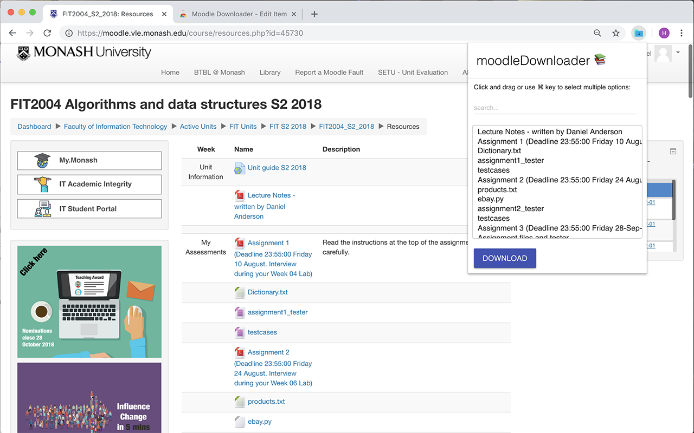

# Moodle Downloader

A Chrome extension for downloading the contents of courses on Moodle all at once instead of doing it manually.

Thus we can archive the resources on Moodle in case that after graduating, we can no longer access it and lose those resources.

https://chromewebstore.google.com/detail/moodle-downloader/ohhocacnnfaiphiahofcnfakdcfldbnh?hl=en

# Moodle Auto Login

A Chrome extension for logging into Moodle automatically without doing anything.

https://github.com/marsyang2410/moodle-auto-login