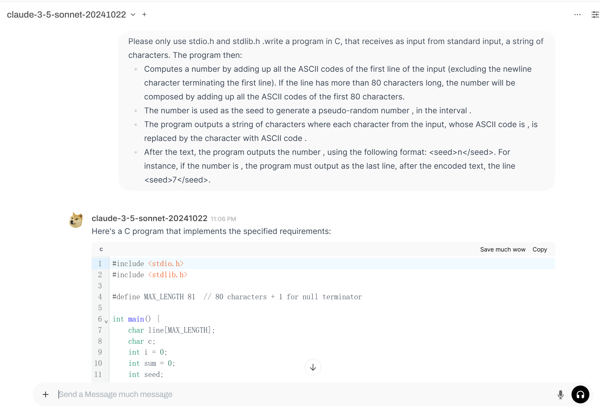

**Congratulation!!!**

I built an AI chatbot website powered by **Open WebUI**. It lets me access multiple LLM APIs (such as Claude) seamlessly from a single unified interface, which is extremely cost-effective.

:::note
The service is currently deployed on a 2GB RAM cloud VPS for personal use. Memory usage is near peak capacity, so scaling or container memory tuning may be planned later.
:::

Overall, the experience has been great!
  

