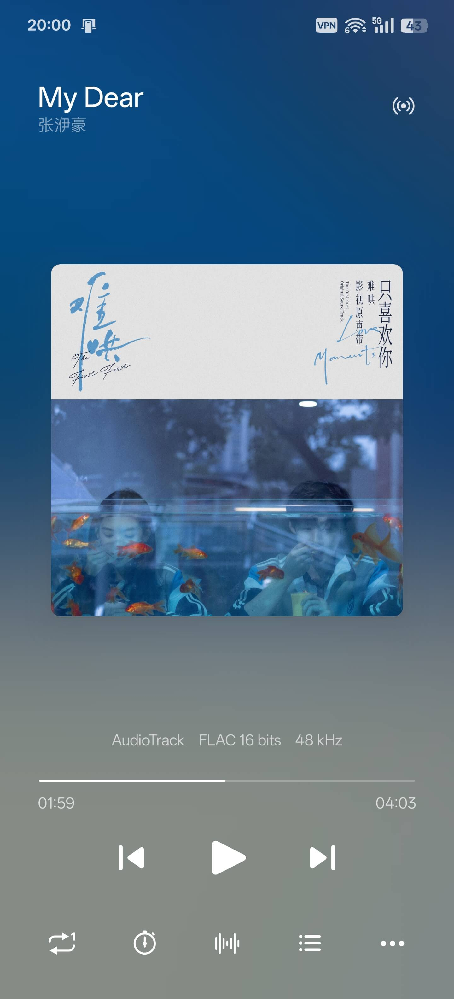
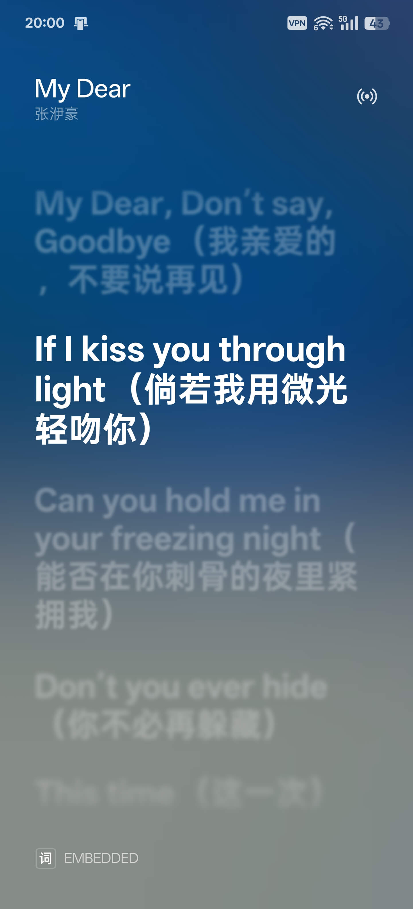
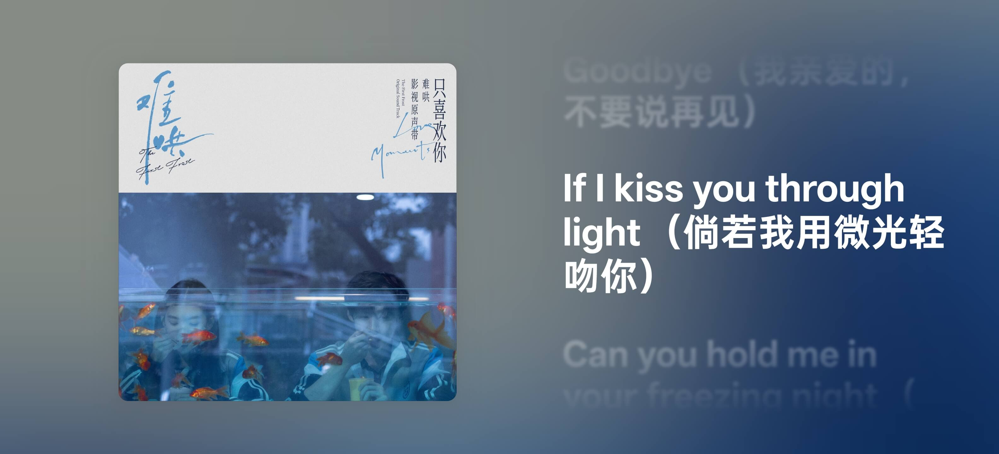

In this article i will show several music software that has a elegant and wonderful animations of lyrics on both local and cloud.

# Local

## Androids

[**Salt Player**](https://play.google.com/store/apps/details?id=com.salt.music) is created by a Chinese [developer](https://github.com/Moriafly) Moriafly. Chinese official website: [Salt Player](https://moriafly.com/program/salt-player.html)

You can also download it in Chinese app market (app store): [酷安](https://www.coolapk.com/) [小米应用商店](https://app.mi.com/) [OPPO应用商店](https://store.oppomobile.com/) and so on...

Preview:

## Windows

### Salt Player for Windows (Beta)

Similar to **Salt Player for Androids**, but it's still in beta stage.

You can join the test and view more information here: [Salt Player for Windows](https://moriafly.com/program/spw.html)

Preview:

## AMLL Player (Beta)

A lyric player component library aims to look similar to iPad version of Apple Music.

Preview:

You can join the test and view more information here: [AMLL(applemusic-like-lyrics)](https://github.com/Steve-xmh/applemusic-like-lyrics)

## iPhone

Apple Music !!!

## iMac

Apple Music !!!

## iPad

Apple Music !!!

# Cloud (Support S3/Webdav/Cloud Drive)

## Androids

### Qinalt Player (Beta)

It's total similar or same with **Salt Player**. Here is the link: [Qinalt Player](https://moriafly.com/program/qinalt.html)

### Symfonium

This player is not beautiful enough compared to Salt Player. But it is stable. You can download form Google Store: [Symfonium](https://play.google.com/store/apps/details?id=app.symfonik.music.player)

## Windows

### Astiga

Frankly, i didn't find a beautiful enough player. But it can be used. [Astiga - Your online cloud music player](https://asti.ga/)

### Alist

The music player in web of alist is also not beautiful enough.....

## iPhone

Apple Music !!!

## iMac

Apple Music !!!

## iPad

Apple Music !!!
