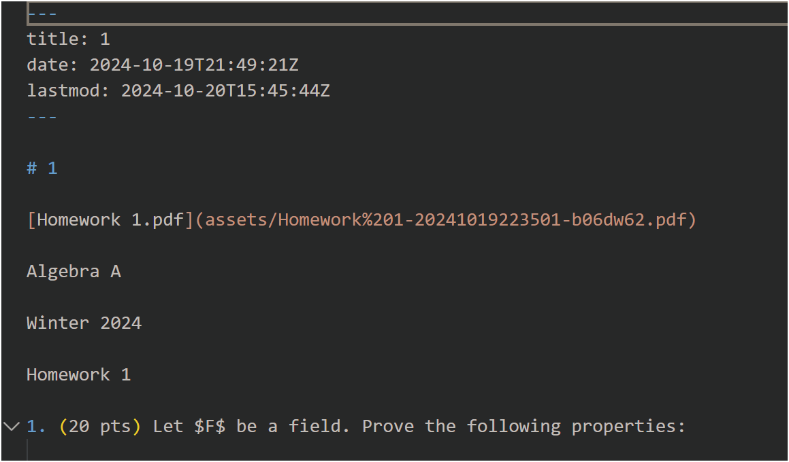

# Background

I use markdown editor to type maths and cs notes, then i use a plugin to publish the .md file into the directory of ECS. Then i can see my note in mkdocs.

However, there are **3 issues**:

1.  The maths formula cannot be rendered
    
2.  The file in the file tree is not ordered according to creation time
    
3.  Some lists dont break into new lines (if occurs)
    

Thus here is the solution

# Solution

## Maths formula rendering

1.  add the following code to `mkdocs.yml`
    

```yaml
markdown_extensions:
  - pymdownx.arithmatex:
      generic: true
  - pymdownx.superfences:
      disable_indented_code_blocks: true

extra_javascript:
  - javascripts/katex.js
  - https://unpkg.com/katex@0/dist/katex.min.js
  - https://unpkg.com/katex@0/dist/contrib/auto-render.min.js

extra_css:
  - https://unpkg.com/katex@0/dist/katex.min.css
```

2.  `cd /docs`
    
3.  `mkdir javascripts`
    
4.  `cd javascripts`
    
5.  `touch katex.js`
    
6.  Write the following code into that .js file
    

```javascript
document$.subscribe(({ body }) => { 
  renderMathInElement(body, {
    delimiters: [
      { left: "$$",  right: "$$",  display: true },
      { left: "$",   right: "$",   display: false },
      { left: "\\(", right: "\\)", display: false },
      { left: "\\[", right: "\\]", display: true }
    ],
  })
})
```

6.  reboot mkdocs service
    

## File ordering by creation time

I use python to generate a manual navigation tree and add it into `mkdocs.yml` , then i just need to set up a cron job.

!!!Please ensure the .md file including YAML metadata. You can add this when exporting .md file in your own markdown editor (if have).

Example of YAML metadata in markdown:  


* * *

1.  `cd /data`
    
2.  `touch generate_nav.py`
    
3.  add the following code into it
    

```python
import os
import glob
import re
import yaml
from datetime import datetime

def extract_date(md_file):
    """
    Extract only the line in the markdown file formatted as `date: 2024-10-19T21:49:21Z`
    """
    with open(md_file, 'r', encoding='utf-8') as f:
        content = f.read()
    match = re.search(r'^date:\s*(\S+)', content, re.MULTILINE)
    if match:
        date_str = match.group(1)
        try:
            dt = datetime.fromisoformat(date_str.replace("Z", "+00:00"))
            return dt
        except Exception as e:
            print(f"Error parsing date in {md_file}: {e}")
    return None

def insert_into_tree(tree, parts, file_info):
    """
    Insert file information into the directory tree based on the parts split from the file's relative path
    """
    if len(parts) == 1:
        tree.setdefault('files', []).append(file_info)
    else:
        dir_name = parts[0]
        tree.setdefault('subdirs', {})
        if dir_name not in tree['subdirs']:
            tree['subdirs'][dir_name] = {}
        insert_into_tree(tree['subdirs'][dir_name], parts[1:], file_info)

def build_tree(docs_path):
    """
    Traverse the docs directory and build a directory tree containing file information,
    where each file info includes title (using the filename without extension), relative path, and extracted date data
    """
    tree = {}
    md_files = glob.glob(os.path.join(docs_path, '**/*.md'), recursive=True)
    for md_file in md_files:
        rel_path = os.path.relpath(md_file, docs_path).replace(os.sep, '/')
        dt = extract_date(md_file)
        title = os.path.splitext(os.path.basename(md_file))[0]
        file_info = {
            'title': title,
            'path': rel_path,
            'date': dt
        }
        parts = rel_path.split('/')
        insert_into_tree(tree, parts, file_info)
    return tree

def sort_tree(tree):
    """
    Sort the files in each directory level by date in descending order (with empty dates at the end), and recursively process subdirectories
    """
    if 'files' in tree:
        tree['files'].sort(key=lambda x: x['date'] if x['date'] is not None else datetime.min, reverse=True)
    if 'subdirs' in tree:
        for sub in tree['subdirs'].values():
            sort_tree(sub)

def tree_to_nav(tree):
    """
    Convert the directory tree into the mkdocs nav configuration format:
      - Files at the current level as {title: file path}
      - Subdirectories as {directory name: [subitems, ...]}
    """
    nav = []
    if 'files' in tree:
        for file in tree['files']:
            # If the filename is index.md, use Homepage: instead of the filename as the title
            if file['title'] == 'index':
                nav.append({'Homepage': file['path']})
            else:
                nav.append({file['title']: file['path']})
    if 'subdirs' in tree:
        for subdir, subtree in sorted(tree['subdirs'].items()):
            sub_nav = tree_to_nav(subtree)
            nav.append({subdir: sub_nav})
    return nav


def main():
    # Set the project directory and switch the working directory to ensure mkdocs.yml can be found
    project_dir = os.path.join(os.getcwd())  # Change to the absolute path of your project root, e.g., '/home/user/my_project'
    os.chdir(project_dir)
    
    docs_path = os.path.join(project_dir, 'docs')
    tree = build_tree(docs_path)
    sort_tree(tree)
    nav_config = tree_to_nav(tree)
    
    mkdocs_file = os.path.join(project_dir, 'mkdocs.yml')
    if not os.path.exists(mkdocs_file):
        print("mkdocs.yml file does not exist, please check if the path is correct.")
        return

    # Read the entire file content
    with open(mkdocs_file, 'r', encoding='utf-8') as f:
        content = f.read()

    # Use regex to find the nav: section and remove it
    # Assuming nav: is the last configuration item, delete everything from nav: to the end of the file
    new_content = re.sub(r'\nnav:.*', '', content, flags=re.DOTALL).rstrip() + "\n\n"
    
    # Convert the new nav configuration to YAML text
    nav_yaml = yaml.dump({'nav': nav_config}, allow_unicode=True, sort_keys=False, default_flow_style=False)
    
    # Concatenate the content and write back to mkdocs.yml
    updated_content = new_content + nav_yaml
    with open(mkdocs_file, 'w', encoding='utf-8') as f:
        f.write(updated_content)
    
    print("mkdocs.yml has been updated, the new nav configuration has overwritten the original nav section.")

if __name__ == '__main__':
    main()
```

4.  `python3 generate_nav.py` (Note: it will process all the .md file in your directory and subdirectories and update yml)
    

Check: If you see `nav:` at the end of your `mkdocs.yml` , then it succeeded.

Example:


## Issue of breaking into new lines in list

If you don't have this issue, you can omit this.

Some of my source code of .md files is like

```markdown
1. The first idea, first line

    The first idea, second line
2. The second idea, first line
```

Then mkdocs will render it like

```markdown
1. The first idea, first line
    The first idea, second line2. The second idea, first line
```

Then problem is that there isn't a new line between `The first idea, second line` and `2. The second idea, first line`

Thus we need to add a new line between them to render it correctly, like this

```markdown
1. The first idea, first line

    The first idea, second line

2. The second idea, first line
```

* * *

Thus i also use a python script

1.  `cd /docs`
    
2.  create `format_lists.py`
    
3.  add the following code
    

    import os
    import re
    import logging
    
    # Configure logging, record to file and console
    logging.basicConfig(
        level=logging.INFO,  # Set log level to INFO, reducing debug information
        format='%(asctime)s - %(levelname)s - %(message)s',
        handlers=[
            logging.FileHandler('format_lists.log'),
            logging.StreamHandler()
        ]
    )
    
    def is_top_level_list_item(line):
        """Check if a line is a top-level ordered list item (e.g., '1.', '2.'), with no indentation"""
        stripped_line = line.lstrip()
        return re.match(r'^\d+\.\s', stripped_line) is not None and not line.startswith((' ', '\t'))
    
    def is_list_item_content(line):
        """Check if a line is content of a list item (indented or empty line)"""
        return line.startswith((' ', '\t')) or line.strip() == ''
    
    def process_markdown_file(file_path):
        """Process a single Markdown file, adding an empty line between top-level ordered list items"""
        logging.info(f"Starting to process file: {file_path}")
        with open(file_path, 'r', encoding='utf-8') as file:
            lines = file.readlines()
    
        new_lines = []
        in_code_block = False
        in_list_item = False  # Flag to indicate whether processing list item content
    
        for i, line in enumerate(lines):
            stripped = line.strip()
    
            # Skip code blocks
            if stripped.startswith('```'):
                in_code_block = not in_code_block
                new_lines.append(line)
                continue
    
            if not in_code_block:
                if is_top_level_list_item(line):
                    # If currently in a list item and about to start a new list item, insert an empty line
                    if in_list_item:
                        new_lines.append('\n')
                    new_lines.append(line)
                    in_list_item = True
                else:
                    new_lines.append(line)
                    # If not list item content, end the current list item state
                    if not is_list_item_content(line):
                        in_list_item = False
            else:
                new_lines.append(line)
    
        # Check if the file has changed
        if new_lines != lines:
            with open(file_path, 'w', encoding='utf-8') as file:
                file.writelines(new_lines)
            logging.info(f"File {file_path} has been updated")
        else:
            logging.info(f"File {file_path} has not changed")
    
    def process_directory(directory):
        """Traverse the directory, processing all Markdown files"""
        logging.info(f"Starting to process directory: {directory}")
        for root, _, files in os.walk(directory):
            for file in files:
                if file.endswith('.md'):
                    file_path = os.path.join(root, file)
                    process_markdown_file(file_path)
        logging.info(f"Finished processing directory: {directory}")
    
    if __name__ == "__main__":
        directory = '.'  # Process the current directory
        process_directory(directory)

4.  `python3 format_lists.py`
    

Check: You can see the log output to check whether it succeeds

* * *

Here is my directory tree in `/opt/1panel/apps/mkdocs-material/mkdocsmaterial/data` for your reference

    /opt/1panel/apps/mkdocs-material/mkdocsmaterial/data » tree
    ├── docs
    │   │── index.md
    │   ├── format_lists.py
    │   └── javascripts
    │       └── katex.js
    ├── generate_nav.py
    └── mkdocs.yml

* * *

## Cron task

Use a cron task to run it automatically. Set it up by your own. Reference:

```bash
cd /opt/1panel/apps/mkdocs-material/mkdocsmaterial/data && /usr/bin/python3 generate_nav.py
cd /opt/1panel/apps/mkdocs-material/mkdocsmaterial/data/docs && /usr/bin/python3 format_lists.py
```
