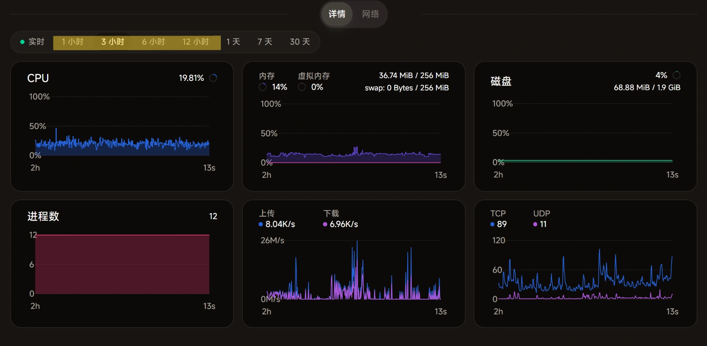

### Introduction
Added 1/3/6/12 hour chart displays to the official Nezha monitoring theme. Previously, it only had real-time/1/7/30 day options. I think the one-hour chart is very useful, but after searching around, no one has implemented it through the official theme. Third-party themes have UI that's not as good as the official one, so I made some code myself.

### Preview


### Usage
Add the following code to the custom code in the settings
```javascript
<script>
(function () {
  'use strict';

  // ===== 配置 =====
  const EXTRA_PERIODS = [
    { value: '1h', label: '1 小时' },
    { value: '3h', label: '3 小时' },
    { value: '6h', label: '6 小时' },
    { value: '12h', label: '12 小时' },
  ];

  // ===== 1. 拦截 fetch：将小时级请求转为 1d 并按时间过滤 =====
  const _fetch = window.fetch;
  const hourRe = /period=(\d+)h/;

  window.fetch = async function (...args) {
    const url = typeof args[0] === 'string' ? args[0] : args[0]?.url;
    if (!url || !url.includes('/metrics?') || !hourRe.test(url)) {
      return _fetch.apply(this, args);
    }

    const hours = parseInt(url.match(hourRe)[1]);
    const newUrl = url.replace(hourRe, 'period=1d');

    const res = await _fetch.call(this, newUrl, ...Array.from(arguments).slice(1));
    const json = await res.json();

    if (json?.data?.data_points?.length) {
      const now = Date.now() / 1000;
      const limit = hours * 3600;
      json.data.data_points = json.data.data_points.filter(function (p) {
        const ts = p.ts > 1e12 ? p.ts / 1000 : p.ts;
        return now - ts <= limit;
      });
    }

    return new Response(JSON.stringify(json), {
      status: res.status,
      statusText: res.statusText,
      headers: new Headers(res.headers),
    });
  };

  // ===== 2. 注入时间选择按钮 =====
  const ATTR = 'data-extra-period';
  let activePeriod = null;
  let lastRendered = Symbol();
  let containerRef = null;
  let setPeriodFn = null;

  const getFiber = (el) => {
    if (!el) return null;
    const key = Object.keys(el).find(k => k.startsWith('__reactFiber$'));
    return key ? el[key] : null;
  };

  const findCallback = (fiber) => {
    let n = fiber;
    while (n) {
      if (n.memoizedProps?.onPeriodChange) return n.memoizedProps.onPeriodChange;
      n = n.return;
    }
    return null;
  };

  const findContainer = () => {
    const dots = document.querySelectorAll('span.bg-emerald-500, span.bg-emerald-400');
    for (const dot of dots) {
      let el = dot.parentElement;
      while (el) {
        if (el.className?.includes?.('bg-muted') && el.className.includes('rounded-full')) return el;
        el = el.parentElement;
      }
    }
    return null;
  };

  const observer = new MutationObserver(() => requestAnimationFrame(inject));

  function inject() {
    const container = findContainer();
    if (!container) return;

    // 检测 React 内置按钮是否有激活态（framer-motion 的 active 指示器）
    // 如果有，说明当前选中的是内置周期，清除自定义激活态
    if (activePeriod !== null) {
      const reactHasActive = [...container.children].some(
        child => !child.hasAttribute(ATTR) && child.querySelector('.absolute.inset-0.z-10')
      );
      if (reactHasActive) activePeriod = null;
    }

    if (container.querySelector(`[${ATTR}]`) && lastRendered === activePeriod) return;

    observer.disconnect();
    container.querySelectorAll(`[${ATTR}]`).forEach(el => el.remove());

    if (container !== containerRef) { setPeriodFn = null; containerRef = container; }
    if (!setPeriodFn) {
      for (const child of container.children) {
        const fiber = getFiber(child.firstElementChild || child);
        if (fiber) { setPeriodFn = findCallback(fiber); if (setPeriodFn) break; }
      }
    }
    if (!setPeriodFn) { resume(); return; }

    let ref = container.children[0];
    if (!ref) { resume(); return; }

    for (const p of EXTRA_PERIODS) {
      const wrapper = document.createElement('div');
      wrapper.setAttribute(ATTR, p.value);

      const btn = document.createElement('div');
      const isActive = activePeriod === p.value;
      btn.className = `relative cursor-pointer rounded-full px-3 py-1.5 text-xs font-medium transition-colors duration-300 ${isActive ? 'text-foreground' : 'text-muted-foreground hover:text-foreground'}`;

      if (isActive) {
        const bg = document.createElement('div');
        bg.className = 'absolute inset-0 z-10 h-full w-full bg-white dark:bg-background rounded-full ring-1 ring-border/60 dark:ring-border/40';
        btn.appendChild(bg);
      }

      const label = document.createElement('div');
      label.className = 'relative z-20 flex items-center gap-1.5';
      label.textContent = p.label;
      btn.appendChild(label);

      wrapper.addEventListener('click', () => { activePeriod = p.value; setPeriodFn(p.value); });
      wrapper.appendChild(btn);
      ref.insertAdjacentElement('afterend', wrapper);
      ref = wrapper;
    }

    for (const child of container.children) {
      if (!child.hasAttribute(ATTR) && !child.hasAttribute('data-bound')) {
        child.setAttribute('data-bound', '');
        child.addEventListener('click', () => { activePeriod = null; }, true);
      }
    }

    lastRendered = activePeriod;
    resume();
  }

  function resume() {
    observer.observe(document.body, { childList: true, subtree: true });
  }

  if (document.body) { resume(); inject(); }
  else document.addEventListener('DOMContentLoaded', () => { resume(); inject(); });
})();
</script>

```