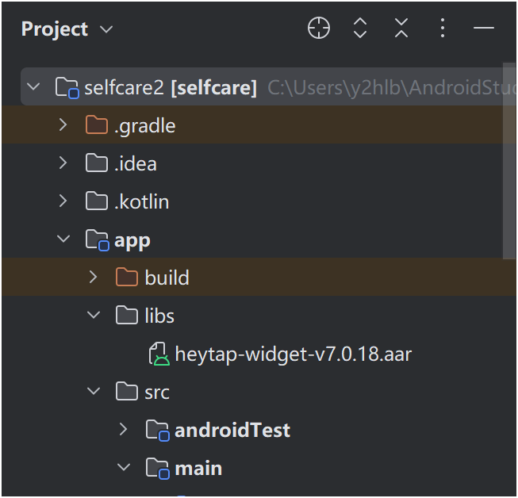
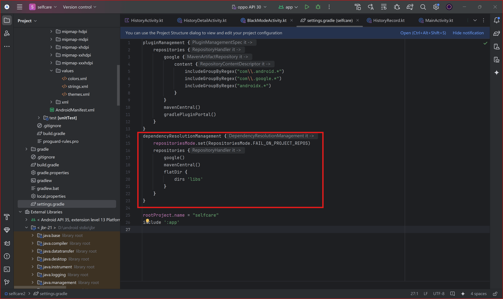
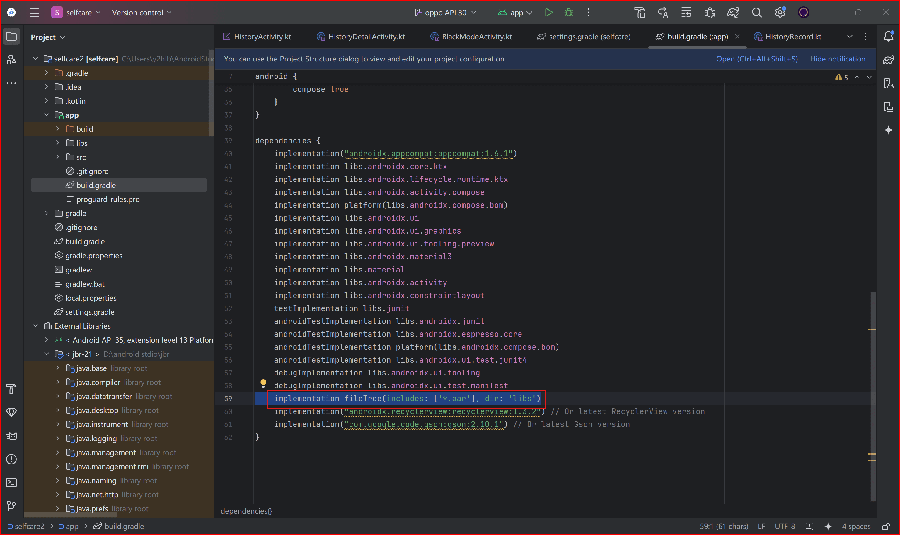

# Step 1

:::tip
关注微信公众号 **OPPO开发者** 并私信客服即可获取最新控件包及开发说明书，调用官方控件可快速实现穿戴设备 UI 规范统一。
附 2025 年初控件包本地备份下载：[202501210915113412.zip](202501210915113412.zip)
:::

# Step 2

打开Android Studio 创建`libs`文件夹 将`aar`压缩包放入 如图

  


# Step 3

打开`settings.gradle` 加入如下代码到`dependencyResolutionManagement`层级下 参考图片

```groovy
repositories {
        google()
        mavenCentral()
        flatDir {
            dirs 'libs'
        }
    }
```



# Step 4

打开app目录下的`build.gradle` 加入如下代码到`dependencies`层级下 参考图片

```groovy
implementation fileTree(includes: ['*.aar'], dir: 'libs')
```



# Step 5

点击右上角`Sync Project with Gradle Files` 按钮或直接`Ctrl+Shift+O`快捷键

* * *

最后即可参考压缩包中手册进行调用开发
