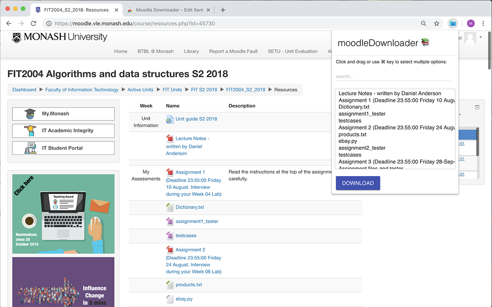

# Moodle Downloader

A Chrome extension for downloading the contents of courses on Moodle all at once instead of doing it manually.

:::tip
Archiving your course materials locally prevents losing access to important lecture slides and notes after graduation when university accounts expire.
:::

https://chromewebstore.google.com/detail/moodle-downloader/ohhocacnnfaiphiahofcnfakdcfldbnh?hl=en

# Moodle Auto Login

A Chrome extension for logging into Moodle automatically without doing anything.

https://github.com/marsyang2410/moodle-auto-login